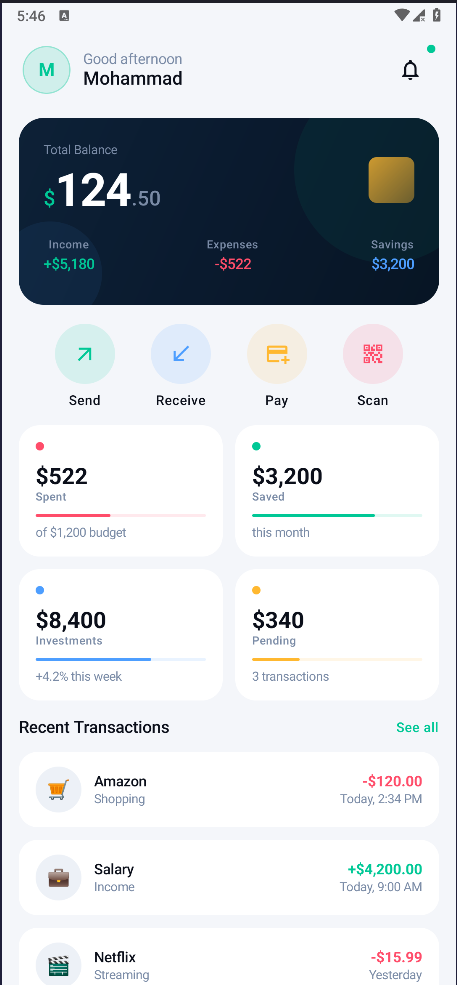

<div align="center">

# 💳 Fintech Dashboard

A modern, dark-themed personal finance dashboard built with Jetpack Compose for Android.

[](https://developer.android.com)
[](https://developer.android.com/jetpack/compose)
[](https://kotlinlang.org)
[](https://m3.material.io)
[](LICENSE)

</div>

---

## 📸 Preview

### Dark Mode


### Light Mode


---

The dashboard features a deep navy dark theme with emerald green accents, smooth entrance animations, an animated balance counter, and a responsive 2×2 stats grid — all built entirely with Jetpack Compose and zero XML.

---

## ✨ Features

- **Animated Balance Card** — Balance counts up from zero on load with a gradient dark card and decorative layered background
- **Quick Actions** — Send, Receive, Pay, and Scan shortcuts with spring-physics press animations and per-action accent colors
- **Spending Stats Grid** — 2×2 card grid displaying Spent, Saved, Investments, and Pending with animated progress bars
- **Transaction History** — Staggered fade-up entrance animations on each transaction row, with color-coded credit and debit amounts
- **Dynamic Greeting** — Header greeting adapts to the time of day (morning / afternoon / evening)
- **Notification Bell** — Header badge indicator for unread notifications
- **Dark & Light Theme** — Full Material 3 color scheme support for both modes via `isSystemInDarkTheme()`
- **Edge-to-Edge UI** — Status bar insets handled natively for a fully immersive layout

---

## 🛠 Tech Stack

| Layer | Technology |
|---|---|
| Language | Kotlin |
| UI Framework | Jetpack Compose |
| Design System | Material 3 |
| Icons | Material Icons Extended |
| Animation | Compose `Animatable`, `spring`, `tween` |
| Architecture | Single-screen component architecture |
| Min SDK | 26 (Android 8.0) |
| Target SDK | 34 (Android 14) |

---

## 🚀 Installation

### Prerequisites

- Android Studio **Hedgehog (2023.1.1)** or later
- JDK 17
- Android SDK with **API Level 34** installed
- A physical device or emulator running **Android 8.0 (API 26)** or higher

### Steps

1. **Clone the repository**

   ```bash
   git clone https://github.com/your-username/fintech-dashboard.git
   cd fintech-dashboard
   ```

2. **Open in Android Studio**

   Open Android Studio → `File` → `Open` → select the cloned project folder.

3. **Sync Gradle**

   Android Studio will prompt you to sync. Click **Sync Now**. This will download all required dependencies including `material-icons-extended`.

4. **Run the app**

   Select your target device from the device dropdown and click the **Run ▶** button, or use:

   ```bash
   ./gradlew installDebug
   ```

> **Note:** The `material-icons-extended` library is approximately 17MB. Initial build times may be slightly longer on first sync.

---

## 📁 Project Structure

```
com.example.fintechdashboard/
│
├── MainActivity.kt
├── DashboardScreen.kt
│
├── component/
│   ├── HeaderSection.kt
│   ├── BalanceCard.kt
│   ├── QuickActionsSection.kt
│   ├── SpendingStatsGrid.kt
│   ├── TransactionItem.kt
│   └── SectionLabel.kt
│
├── data/
│   └── TransactionData.kt
│
└── ui/theme/
    ├── Theme.kt
    └── Type.kt
```

For a detailed breakdown of each file and composable, refer to the [full documentation](DOCUMENTATION.md).

---

## 🤝 Contributing

Contributions are welcome and appreciated. To contribute:

1. **Fork** the repository
2. **Create a feature branch**
   ```bash
   git checkout -b feature/your-feature-name
   ```
3. **Commit your changes** following [Conventional Commits](https://www.conventionalcommits.org/)
   ```bash
   git commit -m "feat: add spending chart to BalanceCard"
   ```
4. **Push to your branch**
   ```bash
   git push origin feature/your-feature-name
   ```
5. **Open a Pull Request** against the `main` branch with a clear description of the change and its motivation

### Guidelines

- Follow the existing composable structure — one responsibility per file
- Maintain the established color token system; do not use raw hex values directly in composables
- Ensure all new components include entrance animations consistent with the rest of the UI
- Test on both dark and light themes before submitting

---


<div align="center">
  Built with ❤️ using Jetpack Compose
</div>
