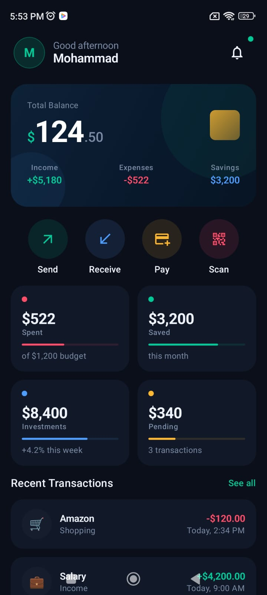
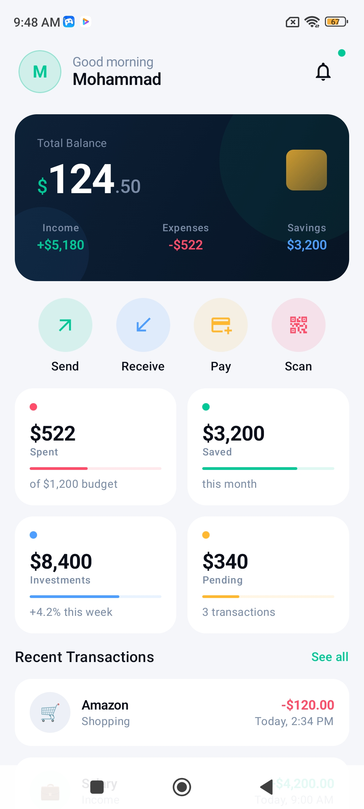

<div align="center">

# 💳 Fintech Dashboard

A modern, dark-themed personal finance dashboard built with Jetpack Compose for Android.

[](https://developer.android.com)
[](https://developer.android.com/jetpack/compose)
[](https://kotlinlang.org)
[](https://m3.material.io)
[](https://square.github.io/retrofit)
[](LICENSE)

</div>

---

## 📸 Preview

<div align="center">
<table>
<tr>
<td align="center">

<br/>
<sub><b>🌙 Dark Mode</b></sub>
</td>
<td width="30"></td>
<td align="center">

<br/>
<sub><b>☀️ Light Mode</b></sub>
</td>
</tr>
</table>
</div>

---

## ✨ Features

- **Live API Data** — All content fetched from a real REST API via Retrofit with Gson deserialization
- **MVI-lite State Management** — `sealed class UiState` with `Loading`, `Success`, `Error`, and `Refreshing` states
- **Shimmer Loading Skeleton** — Animated placeholder layout that mirrors the real UI while data loads
- **Pull-to-Refresh** — Material 3 `PullToRefreshBox` keeps existing data visible while re-fetching
- **Error Screen with Retry** — Friendly error state with a one-tap retry button
- **Animated Balance Card** — Balance counts up from zero on load with a gradient dark card and decorative layered background
- **Quick Actions** — Send, Receive, Pay, and Scan shortcuts with spring-physics press animations and per-action accent colors
- **Spending Stats Grid** — 2×2 card grid displaying Spent, Saved, Investments, and Pending with animated progress bars
- **Transaction History** — Staggered fade-up entrance animations on each transaction row, with color-coded credit and debit amounts
- **Dynamic Greeting** — Header greeting adapts to the time of day (morning / afternoon / evening)
- **Notification Bell** — Header badge indicator for unread notifications
- **Dark & Light Theme** — Full Material 3 color scheme support for both modes via `isSystemInDarkTheme()`
- **Edge-to-Edge UI** — Status bar insets handled natively for a fully immersive layout

---

## 🛠 Tech Stack

| Layer | Technology |
|---|---|
| Language | Kotlin |
| UI Framework | Jetpack Compose |
| Design System | Material 3 |
| Icons | Material Icons Extended |
| Animation | Compose `Animatable`, `spring`, `tween` |
| Networking | Retrofit 2.11 + Gson |
| HTTP Client | OkHttp + Logging Interceptor |
| State Management | ViewModel + `StateFlow` + `sealed class` |
| Concurrency | Kotlin Coroutines (`async`/`await`) |
| Architecture | MVVM + Repository Pattern |
| API | MockAPI REST |
| Min SDK | 26 (Android 8.0) |
| Target SDK | 34 (Android 14) |

---

## 🏗 Architecture

The app follows a clean layered architecture with strict separation between network, domain, and UI concerns.

```
MockAPI REST
    ↓
ApiService (Retrofit — DTOs)
    ↓
DashboardRepositoryImpl (DTO → Domain mapping, Result<T> wrapping)
    ↓
DashboardViewModel (StateFlow<DashboardUiState>)
    ↓
DashboardScreen (collectAsStateWithLifecycle)
    ↓
UI Components
```

### UiState lifecycle

```
App launch
    └── Loading → shimmer skeleton
            ├── Success → full dashboard
            │       └── Pull-to-refresh → Refreshing → Success / Error
            └── Error → error screen + retry → Loading
```

---

## 🚀 Installation

### Prerequisites

- Android Studio **Hedgehog (2023.1.1)** or later
- JDK 17
- Android SDK with **API Level 34** installed
- A physical device or emulator running **Android 8.0 (API 26)** or higher

### Steps

1. **Clone the repository**

   ```bash
   git clone https://github.com/your-username/fintech-dashboard.git
   cd fintech-dashboard
   ```

2. **Open in Android Studio**

   Open Android Studio → `File` → `Open` → select the cloned project folder.

3. **Sync Gradle**

   Android Studio will prompt you to sync. Click **Sync Now**. This downloads all required dependencies including Retrofit and `material-icons-extended`.

4. **Run the app**

   Select your target device from the device dropdown and click the **Run ▶** button, or use:

   ```bash
   ./gradlew installDebug
   ```

> **Note:** The `material-icons-extended` library is approximately 17MB. Initial build times may be slightly longer on first sync.

---

## 📁 Project Structure

```
com.example.fintechdashboard/
│
├── MainActivity.kt
├── DashboardScreen.kt
│
├── network/
│   ├── ApiService.kt
│   ├── RetrofitClient.kt
│   └── models/
│       ├── ProfileDto.kt
│       ├── TransactionDto.kt
│       └── StatDto.kt
│
├── domain/
│   └── models/
│       ├── Profile.kt
│       ├── Transaction.kt
│       └── Stat.kt
│
├── repository/
│   ├── DashboardRepository.kt
│   └── DashboardRepositoryImpl.kt
│
├── viewmodel/
│   ├── DashboardUiState.kt
│   └── DashboardViewModel.kt
│
├── component/
│   ├── ShimmerEffect.kt
│   ├── DashboardSkeleton.kt
│   ├── ErrorState.kt
│   ├── HeaderSection.kt
│   ├── BalanceCard.kt
│   ├── QuickActionsSection.kt
│   ├── SpendingStatsGrid.kt
│   ├── TransactionItem.kt
│   └── SectionLabel.kt
│
└── ui/theme/
    ├── Theme.kt
    └── Type.kt
```

For a detailed breakdown of each file and composable, refer to the [full documentation](DOCUMENTATION.md).

---

## 🌐 API

The app connects to a MockAPI project with two endpoints:

| Endpoint | Method | Description |
|---|---|---|
| `/profile` | `GET` | Returns user name, balance, income, expenses, savings, and stats array |
| `/transactions` | `GET` | Returns list of recent transactions |

The base URL is configured in `network/RetrofitClient.kt`. To point the app at a different API, update the `BASE_URL` constant there.

> **Note:** API responses are logged in full in Logcat during debug builds via `HttpLoggingInterceptor`. This is automatically inactive in release builds.

---

## 🤝 Contributing

Contributions are welcome and appreciated. To contribute:

1. **Fork** the repository
2. **Create a feature branch**
   ```bash
   git checkout -b feature/your-feature-name
   ```
3. **Commit your changes** following [Conventional Commits](https://www.conventionalcommits.org/)
   ```bash
   git commit -m "feat: add spending chart to BalanceCard"
   ```
4. **Push to your branch**
   ```bash
   git push origin feature/your-feature-name
   ```
5. **Open a Pull Request** against the `main` branch with a clear description of the change and its motivation

### Guidelines

- Follow the existing composable structure — one responsibility per file
- Maintain the established color token system; do not use raw hex values directly in composables
- Ensure all new components include entrance animations consistent with the rest of the UI
- The ViewModel must never reference DTOs — all data passed to the UI must be domain models
- Test on both dark and light themes before submitting

---

<div align="center">
  Built with ❤️ using Jetpack Compose
</div>
